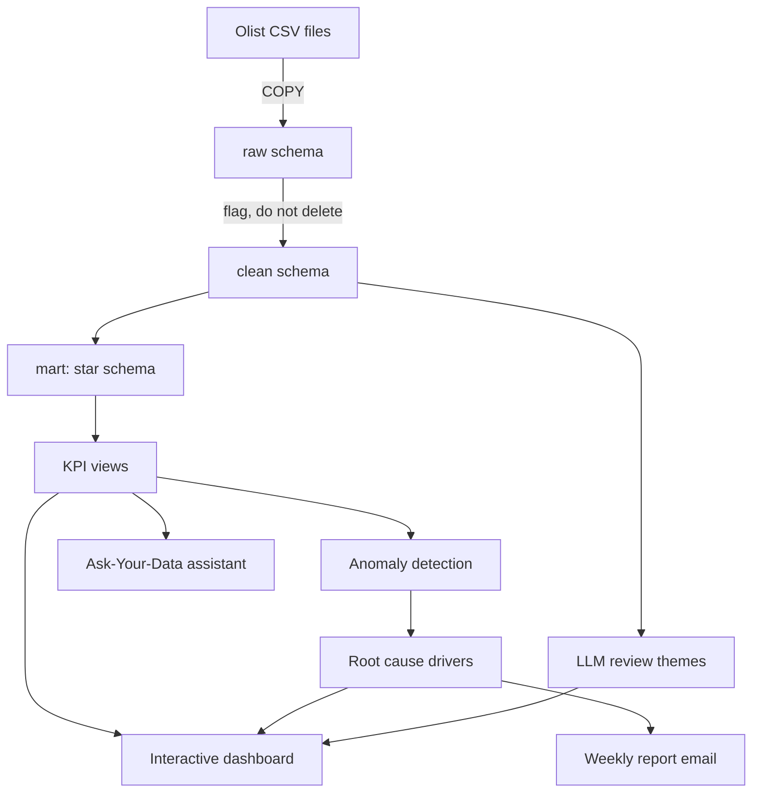

# AI-Powered Business KPI Analytics & Anomaly Monitoring Dashboard

An end-to-end analytics project on 100K real e-commerce orders: a SQL data model and KPI layer, statistical anomaly detection with root-cause analysis, an interactive dashboard, and an AI assistant that answers business questions in plain English by writing and safely running SQL.

**Stack:** PostgreSQL · SQL · Python (Pandas, SciPy, scikit-learn) · Streamlit · Plotly · Google Gemini · FAISS

---

## What it does

| Layer | What happens | Where |
|---|---|---|
| Load | 8 CSV files bulk-loaded into PostgreSQL with `COPY`, row counts verified | `src/load.py`, `sql/01_raw_schema.sql` |
| Validate and clean | 19 data-quality checks; problems are flagged, not deleted; every rule is logged | `src/validate.py`, `sql/02_clean.sql` |
| Model | Star schema: 2 fact tables, 4 dimensions | `sql/03_star_schema.sql` |
| KPIs | 8 KPIs as SQL views at daily, weekly and monthly grain, and by category, state and payment type | `sql/04_kpi_views.sql` |
| Analysis | Trends, seasonality, cohort retention, hypothesis test | `notebooks/eda.ipynb`, `sql/05_cohort_retention.sql` |
| Anomalies | Rolling z-score, IQR and Isolation Forest on daily KPIs | `src/detect_anomalies.py` |
| Root cause | For each major anomaly, which categories, states and payment types drove it | `sql/06_root_cause.sql` |
| Review intelligence | An LLM sorts Portuguese review comments into complaint themes | `src/ai/review_themes.py` |
| Website and dashboard | Project home page, four dashboard pages, and two pages on how it was built | `app/dashboard.py`, `app/views/` |
| Ask-Your-Data | English question → SQL → answer and chart, with RAG and safety checks | `src/ai/`, `app/ask_your_data.py` |
| Reporting | Weekly summary email with KPIs, anomalies and an AI-written summary | `src/report.py` |



---

## Data

[Brazilian E-Commerce Public Dataset by Olist](https://www.kaggle.com/datasets/olistbr/brazilian-ecommerce) (Kaggle, licence CC BY-NC-SA 4.0): real, anonymised orders from a Brazilian marketplace.

- 99,441 orders and 112,650 order items across 8 related tables
- Analysis window: January 2017 to August 2018 (20 months, 99,092 orders)
- Months outside the window hold only a few hundred orders and are flagged, not deleted

---

## KPIs

| KPI | Definition |
|---|---|
| Revenue | Sum of price + freight for **delivered** orders |
| Orders | All orders placed |
| Average order value | Revenue ÷ delivered orders |
| Month-over-month growth | Change against the previous month, using `LAG()` |
| Cancellation rate | % of orders canceled or unavailable |
| Late delivery rate | % of delivered orders that arrived after the estimated date |
| Average delivery days | Purchase to delivery |
| Average review score | 1 to 5, one review per order |

Monthly revenue is cross-checked against an independent Pandas calculation from the raw CSVs (`src/crosscheck.py`); all 20 months match to the cent.

---

## Key findings

1. **Revenue grew 2.8x in a year**, from about R$ 377K a month (Jan–Jun 2017) to R$ 1.07M (Jan–Jun 2018). Total revenue in the window: R$ 15.4M.
2. **Late delivery is the clearest driver of bad reviews.** Late orders average 2.27 stars against 4.29 for on-time orders; 62% of late orders get 1–2 stars compared with 9% of on-time ones (Mann-Whitney U, p < 0.001).
3. **A delivery crisis in February–March 2018.** For orders placed between 19 Feb and 18 Mar, the weekly late rate reached 19–26% (normal: about 5%) and the average review score fell to 3.5.
4. **Black Friday 2017 was a broad spike, not one segment.** 1,176 orders against an expected 170 (+591%). Credit-card orders made 81% of the extra revenue and São Paulo 32%, but the top category accounted for only 13%.
5. **Revenue is concentrated.** 7 of 74 categories bring half the revenue; three states (SP, RJ, MG) bring 63%.
6. **Almost nobody buys twice.** Only 3% of customers placed a second order, so growth depends on new customers.

---

## Project website and dashboard

One Streamlit app (`app/dashboard.py`) presents the whole project.

| Section | Pages |
|---|---|
| Project | Home: what was built, headline numbers, the main findings |
| Dashboard | Overview · Sales drill-down · Anomalies and root cause · Delivery and customer voice |
| How it was built | Data model and SQL (cleaning rules, star schema, featured queries with results) · AI assistant (flow, recorded examples, accuracy, safety tests) |

The dashboard pages share a period filter and a state filter. Their data files hold counts and sums rather than ready-made averages, so every KPI is recalculated exactly for whatever is selected; the totals match the SQL views.

The site reads small files in `app/data/`, so it runs without the database. With the database and an API key configured it adds a live "Ask your data" chat page.

---

## Anomaly detection

Each day is compared with the 28 days before it, using three methods:

| Method | Idea |
|---|---|
| Rolling z-score | How many standard deviations the day is from its 28-day average |
| IQR rule | Whether the day's gap from the 28-day median is an extreme outlier |
| Isolation Forest | Whether the combination of all KPIs that day is unusual |

A day is **high severity** when at least two methods agree or |z| > 4. Result: **54 anomalies over 567 days** (19 high, 35 medium). Black Friday is detected by all three methods (z = 23.6).

---

## AI features

### Ask-Your-Data assistant

```
question → retrieve KPI rules + example queries (FAISS) → LLM writes one SELECT
        → safety check → run as read-only user → LLM words the answer from the rows
```

The LLM never calculates a number: every figure comes from the database.

**Safety, in two independent layers**

1. `src/ai/sql_guard.py` parses the SQL and allows only a single `SELECT` on the `mart` schema, with a row limit. It is tested against 19 cases including `DROP`, `DELETE` hidden in a CTE, multiple statements, `SELECT INTO`, system catalogs and `pg_sleep`; all are blocked.
2. The query runs as a database user that has `SELECT` on `mart` only, in a read-only transaction with a 10-second timeout.

**Accuracy**

Measured as execution accuracy on 25 test questions with hand-written correct queries: an answer counts only if its result rows match. None of the test questions is among the examples in the knowledge base.

| Difficulty | With RAG | Without RAG |
|---|---|---|
| Easy (10) | 9 | 8 |
| Medium (10) | 9 | 6 |
| Hard (5) | 5 | 3 |
| **Total (25)** | **23 (92%)** | **17 (68%)** |

Without retrieval the model sees only table and column names. Its typical mistakes are business-rule mistakes: forgetting the analysis window, returning a rate as a fraction instead of a percentage, and counting `customer_id` instead of the real customer. Retrieval fixes these by supplying the KPI definitions.

The two failures with RAG: one query counted all orders without the analysis-window filter, and one returned a monthly share where an overall share was asked.

Model: `gemini-3.5-flash-lite` (chosen for its free-tier limits), embeddings `gemini-embedding-001`.

### Review intelligence

Review comments are free text in Portuguese. An LLM labels each one with a theme from a fixed list of eight, a sentiment and a short English summary. A fixed sample of 3,000 reviews is used (2,000 with 1–2 stars, 500 with 3, 500 with 4–5), since complaints are what the business needs to understand.

What the 2,000 low-score reviews complain about:

| Theme | Share |
|---|---|
| Wrong or missing item | 26.8% |
| Not received | 20.9% |
| Late delivery | 14.2% |
| Seller or service | 14.1% |
| Poor quality | 12.8% |
| Damaged or defective | 8.4% |
| Other / positive | 3.0% |

- **Delivery problems (late + not received) are 35% of complaints**, and **wrong or incomplete orders are the single largest theme**, which the delivery KPIs alone do not show.
- **The labels agree with the order data.** Reviews labelled "late delivery" belong to orders that really were late 74% of the time; for "poor quality" or "wrong item" reviews that figure is 4–6%. The model never saw the delivery dates, so this is an independent check.
- **During the February–March 2018 delivery crisis, delivery complaints rose to 57%** of low-score reviews, from 32% in other periods.

---

## Limitations

- **The last days of the export are incomplete.** After 22 August 2018 daily orders fall from about 250 to almost zero. This looks like the export being cut off, so those days are flagged (`is_complete_data`) and excluded from anomaly detection.
- **Rolling z-scores catch sudden changes, not slow ones.** The February–March 2018 delivery problem built up over weeks, so it shows in the weekly and monthly KPIs rather than as a daily spike.
- **Root-cause analysis covers revenue and orders only**, because those add up across segments; rates do not.
- **Review themes come from a sample** weighted towards low scores, so theme counts describe the sample, not the whole business.
- **The data is static.** A live version would need incremental loads and scheduled runs.

---

## Run it

Requirements: Python 3.11+, PostgreSQL 14+.

```bash
python -m venv .venv && source .venv/bin/activate
pip install -r requirements.txt
cp .env.example .env          # then fill in DATABASE_URL (and GEMINI_API_KEY for the AI features)
createdb olist_analytics
```

Download the dataset from Kaggle and put the CSV files in `data/raw/`. Then:

```bash
python run_pipeline.py              # load → clean → model → KPIs → anomalies → export → report
python -m src.validate              # data quality report
python -m src.crosscheck            # SQL vs Pandas revenue check
streamlit run app/dashboard.py      # the project website and dashboard
```

The dashboard reads small summary files in `app/data/` that are kept in the repository, so it also runs without the database: `pip install -r requirements.txt` and `streamlit run app/dashboard.py` is enough to see it.

AI features (need `GEMINI_API_KEY`):

```bash
python -m src.ai.knowledge_base     # build the FAISS index
python -m src.ai.review_themes      # label the review sample
python -m src.ai.sql_guard          # safety self-test
python -m src.ai.evaluate sql       # accuracy test
```

With the database and the API key in `.env`, the dashboard shows a fifth page, "Ask your data".

---

## Project structure

```
├── run_pipeline.py          one command for the whole pipeline
├── sql/                     schema, cleaning, star schema, KPI views, cohort, root cause, read-only role
├── src/
│   ├── load.py, validate.py, crosscheck.py, detect_anomalies.py, export.py, report.py
│   └── ai/                  llm.py, review_themes.py, knowledge_base.py, sql_guard.py, text_to_sql.py, evaluate.py
├── knowledge/               KPI glossary, table notes, example queries (the RAG knowledge base)
├── eval/                    test questions and results
├── notebooks/eda.ipynb      exploratory analysis and hypothesis test
├── app/
│   ├── dashboard.py         website entry point
│   ├── views/               home, dashboard and how-it-was-built pages
│   ├── ask_your_data.py     chat page for the AI assistant
│   └── data/                small summary tables the dashboard reads
└── data/                    raw CSVs and full exports (not in git)
```
